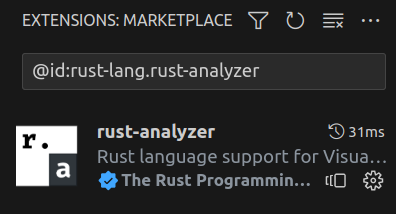

# vscode-extension-ids
Simple rust parser to extract a list of installed extension ID's from VSCode and VSCodium

# Usage
The script has one required and two optional parameter

```
vscode-extension-ids -p <PATH_TO_EXTESION_FILE> -o ~/Desktop -w
```

Filepath is the path to the extensions.json file. Most of the time you find them
- For VSCodium in: `~/.vscode-oss/extensions/extensions.json`
- For VSCode in: `~/.vscode/extensions/extensions.json`

The second parameter `-w` will add a prefix `@id:` to the output of the script. This is useful if you want to save the IDs to later copy-paste the extension name in the extensions marketplace search.



With -o you can specify an output path. If provided, the list of extensions will be written to a .txt file at the specified path and is not printed to the console.

## Example usages

```
vscode-extension-ids -p ~/.vscode-oss/extensions/extensions.json
```

output:
```
astro-build.astro-vscode
ms-python.python
rust-lang.rust-analyzer
```

### With `-w`

```
vscode-extension-ids -p ~/.vscode-oss/extensions/extensions.json -w
```

output:
```
@id:astro-build.astro-vscode
@id:ms-python.python
@id:rust-lang.rust-analyzer
```

### With `-o`

```
vscode-extension-ids -p ~/.vscode-oss/extensions/extensions.json -o ~/Desktop -w
```

output:
```
File saved to /home/foobar/Desktop/extensions.txt
```
